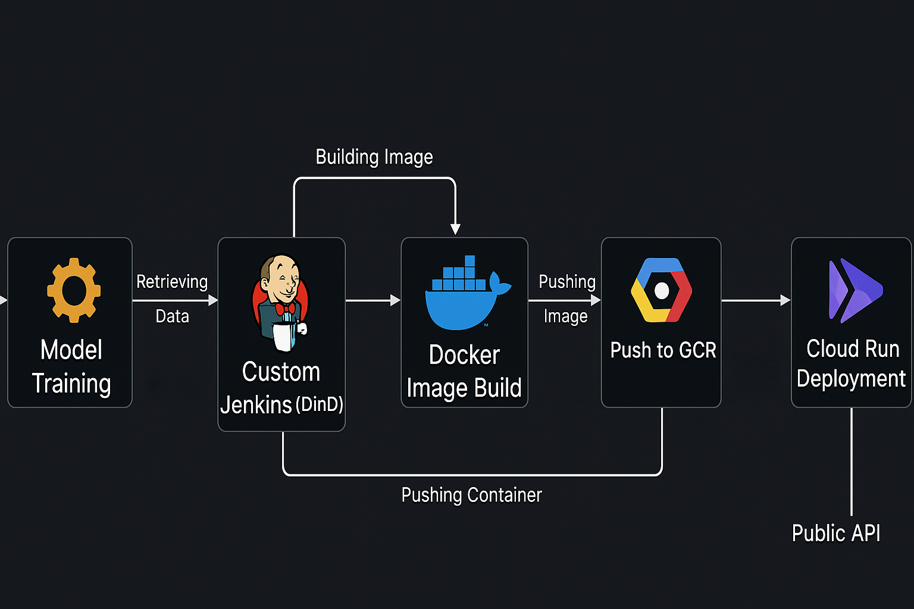
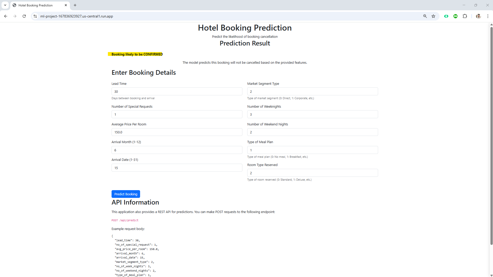

# 🚀 ReserveAI: End-to-End MLOps Pipeline for Room Reservation Prediction


<div align="center">
  <a href="https://ml-project-167836923927.us-central1.run.app/">
    
  </a>
  <p>🚀 <strong>Production Environment:</strong> <a href="https://ml-project-167836923927.us-central1.run.app/">Live Demo</a></p>
</div>

---

## 🧠 About ReserveAI

ReserveAI is a full-stack MLOps pipeline deployed on **Google Cloud Platform (GCP)**. It automates model training, testing, deployment, and monitoring for a room reservation prediction model. It utilizes **FastAPI** for serving the model with API documentation, **Docker** for containerization, and **Jenkins (Docker-in-Docker)** for CI/CD automation.

---

## 📦 Key Features

- ✅ End-to-end ML lifecycle orchestration
- ✅ Data ingestion from Google Cloud Storage (GCS)
- ✅ CI/CD pipeline using Jenkins with Docker-in-Docker setup
- ✅ Model API built with FastAPI and containerized
- ✅ Cloud deployment with Google Cloud Run

---

## 🧱 Project Structure

```bash
ReserveAI_MLOps_E2E/
│
├── pipeline/                 # Jenkins + Docker CI/CD scripts
├── config/                   # Configuration files
├── custom_jenkins/           # Jenkins-in-Docker setup
├── src/                      # Model training, preprocessing, and evaluation
├── notebook/                 # EDA and prototyping notebooks
├── templates/                # Front-end UI templates
├── application.py            # FastAPI app for inference
├── Dockerfile                # Container build definition
├── Jenkinsfile               # Jenkins CI/CD pipeline stages
├── pyproject.toml            # Dependency management
└── README.md
```

---

## 🗺️ Architecture Overview



### Workflow Summary:

- **Data Ingestion**  
  Load training data from Google Cloud Storage.

- **Model Training**  
  Train the ML model and serialize it for later use.

- **CI/CD with Jenkins (DinD)**  
  Automate testing, building, and pushing containers via Jenkins pipelines.

- **Containerization with Docker**  
  FastAPI inference service is built into a Docker image.

- **Deployment via Cloud Run**  
  Final container image is deployed serverlessly using Cloud Run.

---

## 🗺️ Demo Preview




## 🛠️ Tech Stack

| Stage               | Tool/Service                  |
|--------------------|-------------------------------|
| Data Storage        | Google Cloud Storage (GCS)    |
| CI/CD Orchestration| Jenkins (Docker-in-Docker)    |
| API Framework       | FastAPI                       |
| Containerization    | Docker                        |
| Image Registry      | Google Container Registry     |
| Deployment          | Google Cloud Run              |
| Language            | Python                        |

---

## 🚀 Quickstart Guide

### 1. Clone the Repository

```bash
git clone https://github.com/yogeshkumarpilli/ReserveAI_MLOps_E2E.git
cd ReserveAI_MLOps_E2E
```

### 2. Set Up the Environment

```bash
uv init
source .venv/bin/activate  # For Linux/macOS
.venv/Scripts/activate     # For Windows
uv sync
uv build
```

---

## 📈 Model Training

1. Authenticate with GCP:
   ```python
   from google.cloud import storage
   client = storage.Client()
   bucket = client.bucket('your-gcs-bucket-name')
   ```

2. Run the training script:
   ```bash
   python pipeline/training.py
   ```

3. The trained model will be serialized and stored.

---

## 🐳 CI/CD with Jenkins (DinD)

To automate the pipeline:

1. Spin up Jenkins from `custom_jenkins/Dockerfile`.
2. Mount Docker socket inside Jenkins container.
3. The `Jenkinsfile` includes:
   - Linting and testing
   - Docker image build
   - Push to GCR
   - Cloud Run deployment

---

## 📦 Docker Build & GCR Push

```bash
gcloud auth login
gcloud config set project YOUR_PROJECT_ID

docker build -t gcr.io/YOUR_PROJECT_ID/reserveai-api .
docker push gcr.io/YOUR_PROJECT_ID/reserveai-api
```

---

## ☁️ Deploy to Google Cloud Run

```bash
gcloud run deploy reserveai-api   --image gcr.io/YOUR_PROJECT_ID/reserveai-api   --platform managed   --region us-central1   --allow-unauthenticated
```

---

## 🧪 Testing Instructions

Run unit tests with:

```bash
pytest tests/
```

---

## ⚙️ Environment Requirements

- Python 3.10+
- FastAPI
- uvicorn
- scikit-learn
- pandas
- google-cloud-storage
- Docker
- Jenkins

Install all dependencies:

```bash
uv sync
```

---

## 📬 Contact

**Yogesh Kumar Pilli**  
GitHub: [@yogeshkumarpilli](https://github.com/yogeshkumarpilli)  
Email: pilliyogeshkumar@gmail.com

---
